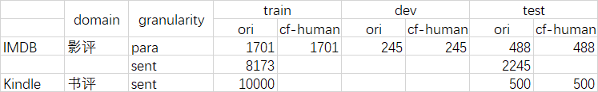
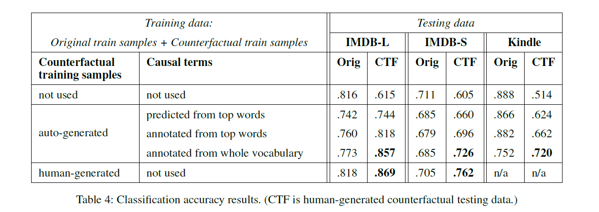

# 问题
情感分析中的虚假相关
# 现在方法
1. 学习与标签因果相关的特征

  应用场景：特征选择、注意力监督、先验知识、领域调整

  - Michael J. Paul. 2017. Feature Selection as Causal Inference: Experiments with Text Classification. In *Proceedings of the 21st Conference on Computational Natural Language      Learning (CoNLL 2017)*, pages 163–172. Association for Computational Linguistics. PSM（倾向分数匹配）方法寻找情感分析模型的因果特征词，因果推断的一种方式。
  - Zhao Wang and Aron Culotta. 2020. Identifying Spurious Correlations for Robust Text Classification. In *Findings of the Association for Computational Linguistics: EMNLP 2020*, pages 3431–3440. Association for Computational Linguistics. 00001. 训练初始分类器，比如：逻辑回归，根据初始模型，抽取重要的词，计算这些词的特征（反事实之后的相似度）平均相似度，方差，初始系数。。。。等等，训练一个区分虚假相关词和真实相关词的分类器，事先有标注数据，将训练好的模型应用在其他词上面，得到所有词是否是虚假相关的结果。

  通过，human-in-the-loop 反事实数据标注

  - Megha Srivastava, Tatsunori Hashimoto, and Percy Liang. 2020. Robustness to Spurious Correlations via Human Annotations. In *International Conference on Machine Learning*, pages 9109–9119. PMLR. 00006.
  - Divyansh Kaushik, Eduard Hovy, and Zachary Lipton. 2019. Learning The Difference That Makes A Difference With Counterfactually-Augmented Data. 人工生成情感分析/NLI任务的反事实样本，进行数据增强提升稳健性。

  # 本文方法

```python
    通过识别因果特征词语，自动生成反事实文本增强原来数据集共同训练一个鲁棒的情感分类模型
```

1. 检测因果特征词；

   参考因果推断的反事实框架（Winship等人在1999年提出的？），本质上是随机控制实验，就是可能世界嘛？

   训练初始分类器，将分类器（逻辑回归模型）的系数较大的特征作为因果特征的候选项（比如，有$k$​​ 个候选特征词）。这些特征词语是针对所有训练集公用的，想一想逻辑回归模型，不可能针对单独的一个样本。所以，一个词对于所有样本的因果程度是相同的。

   针对每一个候选特征词，$t$ 和一组包括 $t$ 的文档 $D_t=<d_1...d_n>$ 我们寻找一组匹配的文档  $D_t'=<d_1'...d_n'>$​​​  得到$n$​ 组匹配分数。要求被匹配的文档的标签相反。每个特征词选最大的匹配分数作为其因果强度的代表。$k$ 个分数中超过0.95的被认为是因果特征词。

2. 替换样本中的因果特征词 $c$ 为 $c'$，（使用$Pydictionary$ 获得因果项的反义词），并替换原始标签 $y$ 为 $y'$ , 这样我们便从原始样本 $(d, y)$ 得到对应的反事实样本 $(d', y')$​​​ 。数据增强训练。（有的样本可能没有特征词哦？这样的样本会删去吗？）

   是的。

   > We only generate counterfactuals for documents contain at least one causal term.

   

具体的实验对比如下：

1. 使用原始训练数据，训练一个初始的分类模型，在原始测试样本中表现优秀，但是在反事实的测试样本中，准确率下降10%-37%。

2. 使用原始数据+自动生成的反事实样本数据，训练一个稳健的分类器，在原始测试集以及反事实测试集上表现都很好；

3. 使用人类提供的因果特征（标注的重要的因果词语？），用来生成反事实训练样本。我们发现50个因果特征词语，生成反事实的文本一起训练，就可以和人工生成的反事实样本表现的结果相媲美。

   （这说明，只要找到合适的因果词语，文中提到的自动生成反事实样本这种方式是有效的）
   
   






